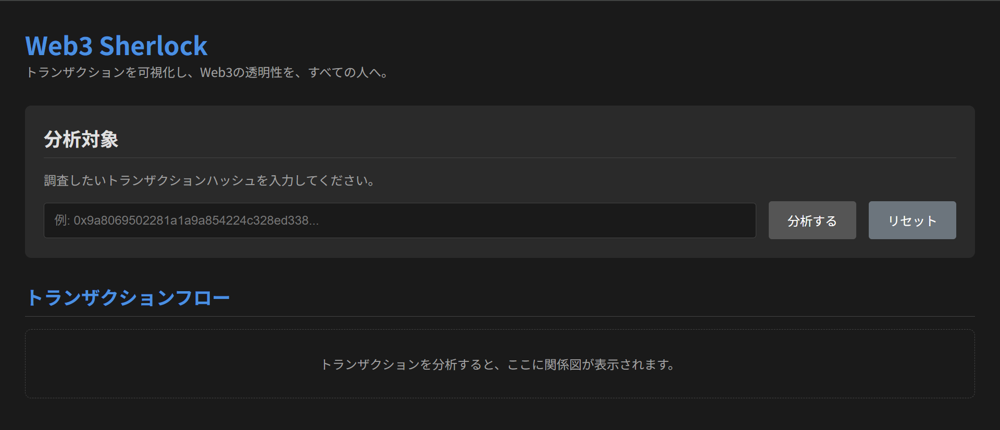
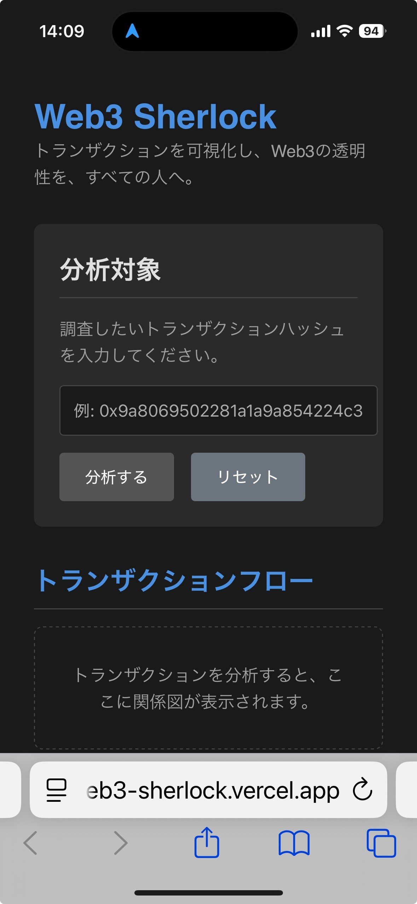

# Web3 Sherlock 🕵️‍♂️

**トランザクションを可視化し、Web3の「透明性の格差」を、すべての人へ。**

Vibe Coding Mini Hackathon 提出作品

**[🚀 公開アプリはこちら！](https://web3-sherlock.vercel.app/)**

---

## 1. 課題：Web3における「検証」の困難性

ブロックチェーンの「透明性」は強力な特性ですが、Basescanのようなブロックエクスプローラーは、初心者にとっては複雑で、専門家との間に深刻な**「透明性の格差」**を生んでいます。
このプロジェクトは、私がインフラ学習で培った「可視化」と「問題切り分け」のスキルを応用し、この課題解決に挑みます。

## 2. 解決策：『Web3 Sherlock』とは？

`Web3 Sherlock`は、Basescanという「六法全書」を、誰もが読める「やさしい法律解説書」へと**"翻訳"**し、トランザクションの**"仕事の流れ"**を**"可視化"**するWebアプリケーションです。

### ✨ 主な機能
- **基本情報の表示:** From, To, 送金額, ガス代など、トランザクションの概要を分かりやすく表示します。
- **フローの可視化:** イベントログを元に、関係するコントラクトとの繋がりを、インタラクティブなグラフとして描画します。
- **レスポンシブ対応:** PCでも、スマートフォンでも、快適に利用できます。

*(PCでの表示例)*

*(スマートフォンでの表示例)*

## 3. 技術スタック
- **フロントエンド:** Next.js, React, TypeScript
- **ブロックチェーン連携:** Viem, Alchemy
- **グラフ描画:** React Flow
- **デプロイ:** Vercel, CI/CD with GitHub Actions

## 4. 私の「学びとストーリー」
タイトル：Web3の「透明性の格差」に挑む 〜インフラエンジニアの視点から〜
1. はじめに：学習の動機
　私は、事務職からのキャリアチェンジを目指し、6ヶ月間の職業訓練でインフラ技術を学びました。特に、Wiresharkを用いたパケット解析や、SSHの公開鍵認証といった、ネットワーク通信とセキュリティの根幹をなす技術の仕組みに、深い知的好奇心を抱きました。これらの学習を通じて、システムの挙動を、表層的ではなく、原理原則から理解することの重要性を学びました。
2. 課題設定：Web3における「検証」の困難性
　今回のハッカソンで、私は初めてWeb3の世界に触れました。ブロックチェーンの「透明性」や「非改ざん性」は、理論上は非常に強力な特性です。しかし、実際にBasescanでトランザクションデータを目の当たりにした時、その複雑さと情報量の多さから、私のような初心者にとっては、その「透明性」が実質的に機能していない、という課題に気づきました。これは、専門家と初心者の間に存在する、深刻な「透明性の格差」です。この課題を、私がインフラ学習で培った「可視化」と「問題切り分け」のスキルを用いて解決できないかと考えたのが、本プロジェクト『Web3 Sherlock』の出発点です。
3. 開発プロセスと技術的挑戦
　開発は、「小さく、段階的に進める」というアジャイル開発の原則に則り、2つのフェーズで進めました。
フェーズ1では、viemとAlchemy APIを利用し、指定されたトランザクションの基本情報（From/To）を表示するMVPを実装しました。この段階で、APIキーの設定ミスや、本番ビルドでの型エラーに起因する数々のデプロイ失敗に直面しましたが、エラーログを論理的に読み解き、原因を一つずつ潰していくという、粘り強いデバッグプロセスを経て、問題を自力で解決できたことは、大きな自信となりました。
フェーズ2では、getTransactionReceipt APIを用いて、トランザクションの内部構造を示す「イベントログ」を取得し、その関係性をReact Flowでグラフとして動的に可視化することに成功しました。これにより、1つのトランザクションが、実は複数のスマートコントラクトによる「共同作業」の記録であることを、視覚的に示すことが可能になりました。
4. 学びと今後の展望
　この開発プロセスを通じて、私はReactを用いたフロントエンド開発の基本サイクルと、GitとVercelを用いたモダンなCI/CDのワークフローを、実践的に学びました。
　一方で、trace_transaction APIが有料プランでのみ提供されるという制約に直面し、現状のMVPでは、イベントログの自動デコードによる、より詳細なトークンフロー（ERC20やNFT）の分析までは至っていない、という限界も認識しています。
　今後の展望としては、まず、このイベントログのデコード機能を実装し、あらゆるトークンの動きを可視化すること。そして、将来的には「個人モード」と「監査モード」を明確に分け、後者にはAIによる異常検知のような、より高度な分析機能を追加していきたいと考えています。
5. 終わりに
　このハッカソンは、私にとって、インフラの知識をWeb3という新しい領域に応用し、初めて一つのアプリケーションを「設計」し「構築」する、かけがえのない経験となりました。今後も、Web3の「検証可能性」を、全てのユーザーにとって身近なものにするための挑戦を続けていきたいと考えています。

## 5. 今後の展望
- **イベントログの完全デコード:** あらゆるトークンの移動（ERC20, NFT）を可視化します。
- **モード分割:** 初心者向けの「個人モード」と、専門家向けの「監査モード」を実装します。
- **AIによる異常検知:** `trace_transaction`API（有料プラン）の活用や、AIによる不審なパターンの警告機能を追加します。
- **エコシステム連携:** Farcaster FrameやCoinbase Wallet Mini Appに対応し、シームレスな体験を提供します。

## 6. 作者
- **　HIROSHI NAGASAWA
- **GitHub: https://github.com/Hdeep04
- **X (Twitter):https://x.com/hr_deep